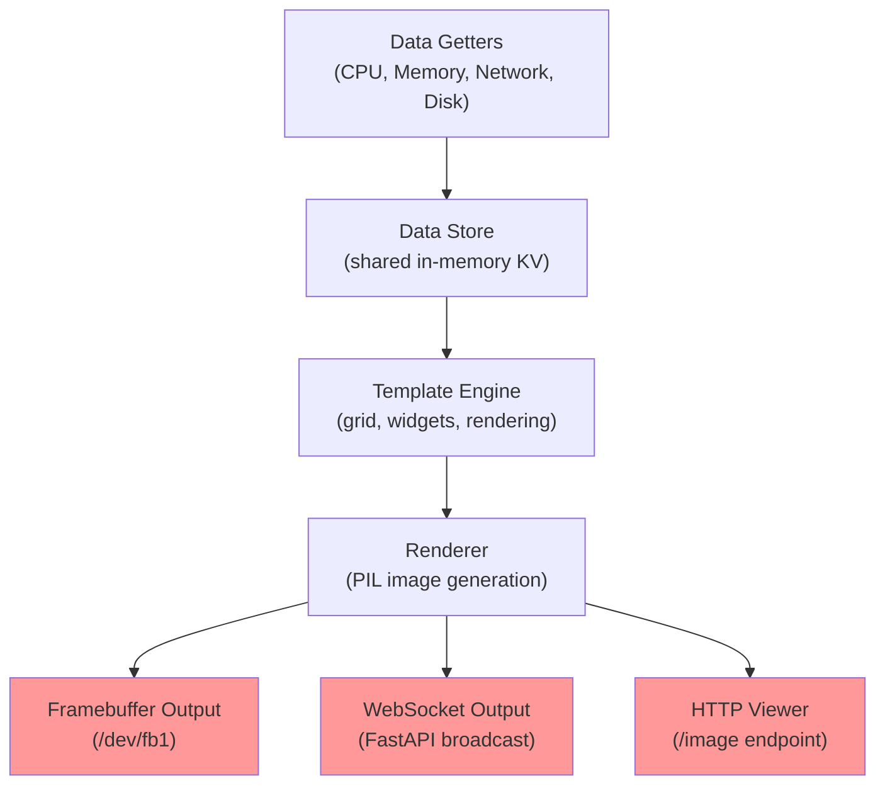
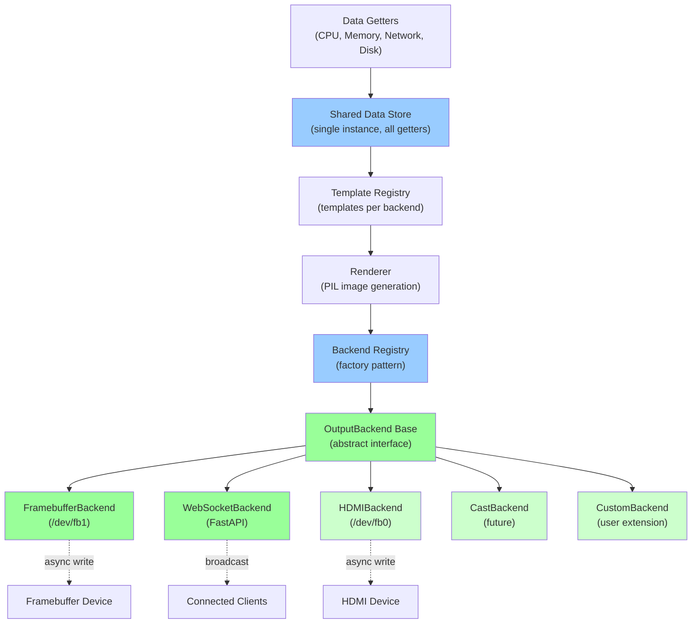
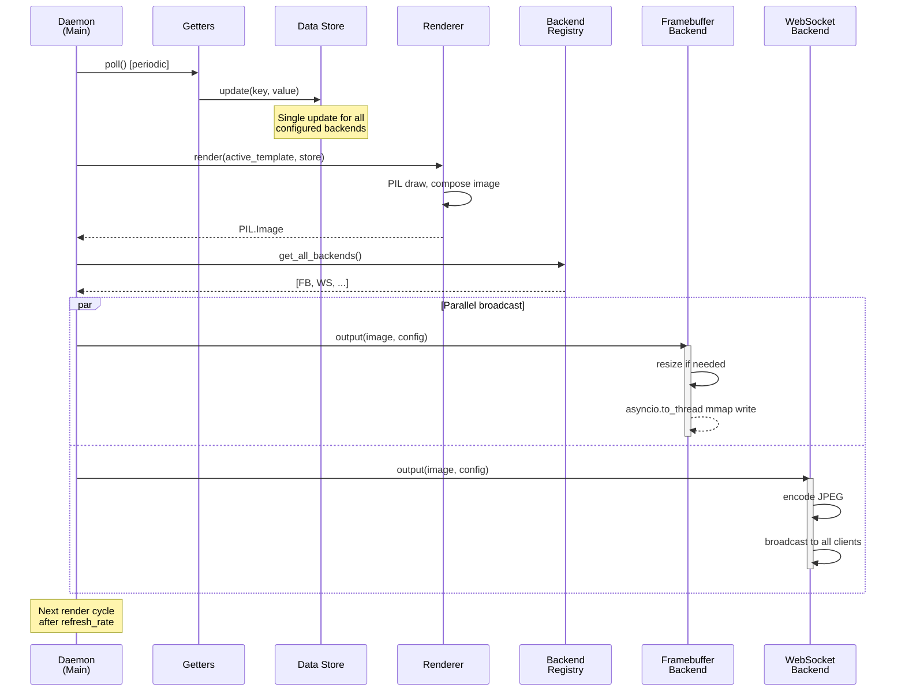
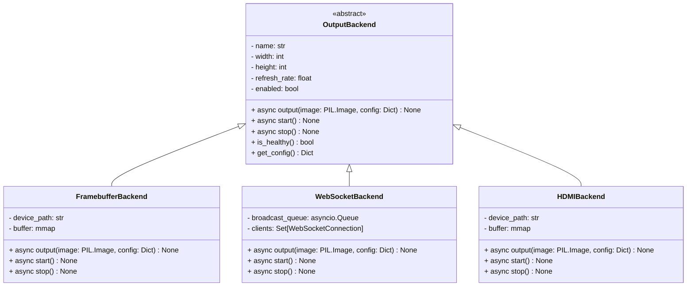
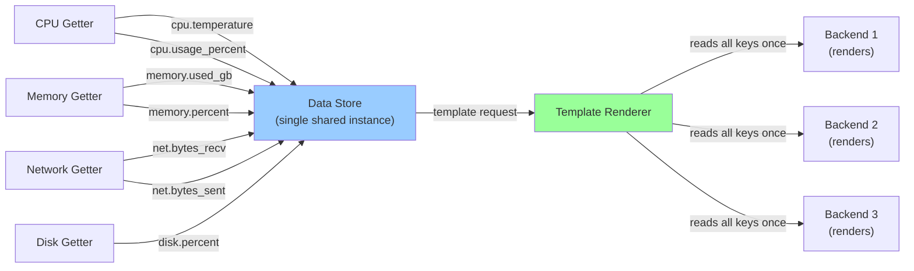

# Multi-Output Backend Architecture

This document describes the pluggable output backend architecture for CASEDD, enabling support for multiple display types (framebuffer, WebSocket, HDMI, etc.) with clean separation of concerns.

## Current Architecture (Tightly Coupled)



**Problem:** Output handling is hardcoded into the render loop. Adding new output types requires modifying core daemon logic. All outputs use the same resolution, template, and refresh rate.

---

## Target Architecture (Pluggable Backends)



**Benefit:** Outputs are pluggable. Each backend has independent configuration (resolution, refresh rate, template). New backends require only a small concrete class. Shared data collection prevents redundant polling.

---

## Component Interaction Sequence



---

## Backend Interface Specification



---

## Config Structure (casedd.yaml)

```yaml
# Example: single framebuffer + multiple WebSocket outputs with different configs
outputs:
  framebuffer_usb:
    type: framebuffer
    enabled: true
    device: /dev/fb1
    width: 800
    height: 480
    refresh_rate: 2.0
    template: system_stats

  websocket_primary:
    type: websocket
    enabled: true
    width: 800
    height: 480
    refresh_rate: 2.0
    template: system_stats
    port: 8765

  websocket_detail:
    type: websocket
    enabled: true
    width: 1024
    height: 600
    refresh_rate: 1.0
    template: detailed_metrics
    port: 8766

  hdmi_display:
    type: hdmi
    enabled: false  # Future
    device: /dev/fb0
    width: 1920
    height: 1080
    refresh_rate: 1.0
    template: fullscreen_dashboard
```

---

## Data Store Design (No Redundant Polling)



**Key:** Getters write to the store once per poll cycle. Template renderer reads the store once and distributes the rendered image to all backends. No duplicate polling or rendering.

---

## Migration Path (MVP Implementation)

### Phase 1: Create Abstraction
- [ ] Create `outputs/base.py` with `OutputBackend` abstract class
- [ ] Define standard interface: `output()`, `start()`, `stop()`, `is_healthy()`
- [ ] Create `outputs/registry.py` with factory pattern

### Phase 2: Refactor Existing Backends
- [ ] Move framebuffer logic → `outputs/framebuffer.py` (implement OutputBackend)
- [ ] Move WebSocket logic → `outputs/websocket.py` (implement OutputBackend)
- [ ] Update HTTP viewer to use registry instead of direct reference

### Phase 3: Update Config & Daemon Loop
- [ ] Extend `config.py` with `outputs` section (list of backend configs)
- [ ] Update `daemon.py` render loop to use registry
- [ ] Ensure all backends read from shared data store (verify no duplicate polling)

### Phase 4: Testing & Documentation
- [ ] Unit tests for registry (instantiation, enable/disable)
- [ ] Integration test for multi-backend output
- [ ] Add mermaid diagrams to docs/
- [ ] Update README with multi-output config example

---

## Notes

- **Backwards Compatibility:** Default behavior (framebuffer + WebSocket on standard ports) preserved when `casedd.yaml` omits `outputs` section.
- **Async Safety:** All backend I/O (mmap writes, WebSocket broadcast) must use `asyncio.to_thread` or native async.
- **Template per Backend:** Each backend can reference a different template if needed (e.g., different layout for 16:9 vs 4:3).
- **Health Monitoring:** Registry tracks backend health. Failed backends can be logged and optionally restarted.
- **Future:** Post-MVP, add hot-reload (add/remove backends without daemon restart), multi-output WebUI collage, deep linking, etc.
