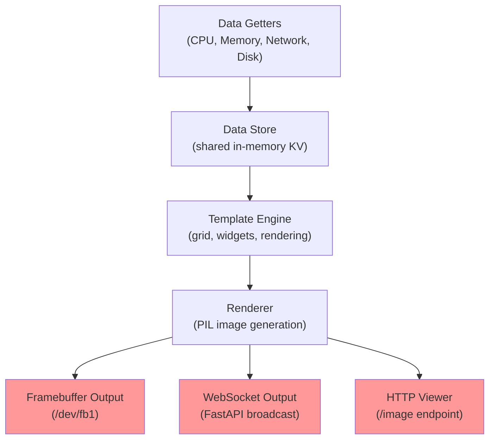
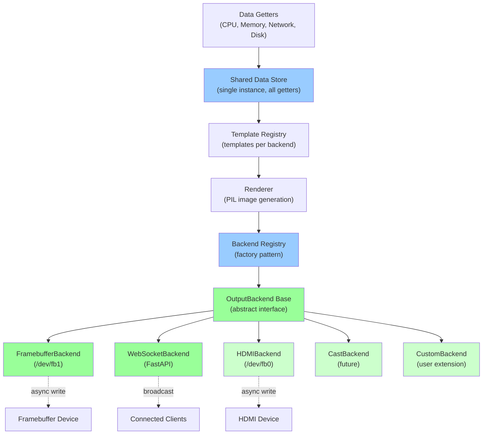
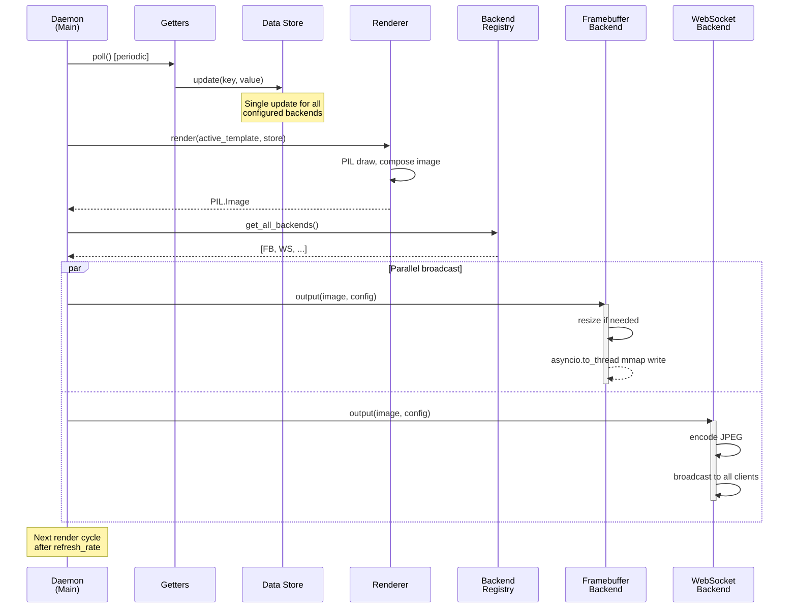
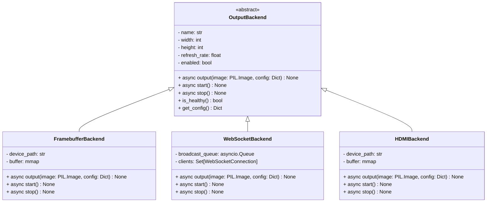
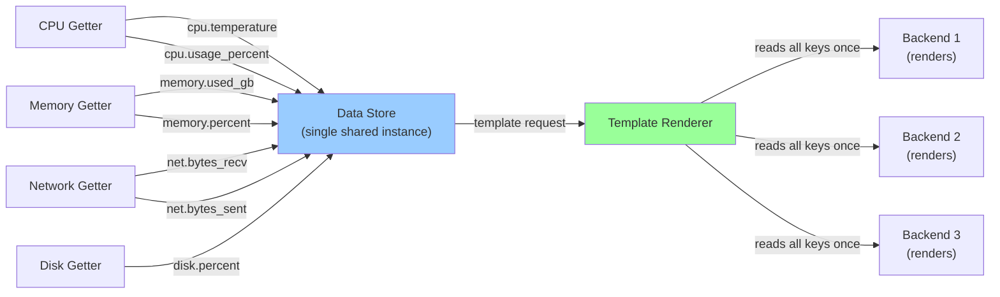

# Multi-Output Backend Architecture

This document describes the pluggable output backend architecture for CASEDD, enabling support for multiple display types (framebuffer, WebSocket, HDMI, etc.) with clean separation of concerns.

## Current Architecture (Tightly Coupled)



**Problem:** Output handling is hardcoded into the render loop. Adding new output types requires modifying core daemon logic. All outputs use the same resolution, template, and refresh rate.

---

## Target Architecture (Pluggable Backends)



**Benefit:** Outputs are pluggable. Each backend has independent configuration (resolution, refresh rate, template). New backends require only a small concrete class. Shared data collection prevents redundant polling.

---

## Component Interaction Sequence



---

## Backend Interface Specification



---

## Config Structure (casedd.yaml)

```yaml
# Example: single framebuffer + multiple WebSocket outputs with different configs
outputs:
  framebuffer_usb:
    type: framebuffer
    enabled: true
    device: /dev/fb1
    width: 800
    height: 480
    refresh_rate: 2.0
    template: system_stats

  websocket_primary:
    type: websocket
    enabled: true
    width: 800
    height: 480
    refresh_rate: 2.0
    template: system_stats
    port: 8765

  websocket_detail:
    type: websocket
    enabled: true
    width: 1024
    height: 600
    refresh_rate: 1.0
    template: detailed_metrics
    port: 8766

  hdmi_display:
    type: hdmi
    enabled: false  # Future
    device: /dev/fb0
    width: 1920
    height: 1080
    refresh_rate: 1.0
    template: fullscreen_dashboard
```

---

## Data Store Design (No Redundant Polling)



**Key:** Getters write to the store once per poll cycle. Template renderer reads the store once and distributes the rendered image to all backends. No duplicate polling or rendering.

---

## Migration Path (MVP Implementation)

### Phase 1: Create Abstraction
- [ ] Create `outputs/base.py` with `OutputBackend` abstract class
- [ ] Define standard interface: `output()`, `start()`, `stop()`, `is_healthy()`
- [ ] Create `outputs/registry.py` with factory pattern

### Phase 2: Refactor Existing Backends
- [ ] Move framebuffer logic → `outputs/framebuffer.py` (implement OutputBackend)
- [ ] Move WebSocket logic → `outputs/websocket.py` (implement OutputBackend)
- [ ] Update HTTP viewer to use registry instead of direct reference

### Phase 3: Update Config & Daemon Loop
- [ ] Extend `config.py` with `outputs` section (list of backend configs)
- [ ] Update `daemon.py` render loop to use registry
- [ ] Ensure all backends read from shared data store (verify no duplicate polling)

### Phase 4: Testing & Documentation
- [ ] Unit tests for registry (instantiation, enable/disable)
- [ ] Integration test for multi-backend output
- [ ] Add mermaid diagrams to docs/
- [ ] Update README with multi-output config example

---

## Performance Optimization Strategy: Rust for Hot Paths

### Analysis of Hot Paths

CASEDD's rendering pipeline has distinct performance characteristics. Not all components are equal candidates for optimization:

```
┌─────────────────────────────────────────┐
│ Data Getters (I/O-bound)                │ ← Limited by system calls, not CPU
│ psutil, hwinfo, procfs reads            │    (e.g., /proc read ~5-10ms)
└─────────────────────────────────────────┘
                    ↓
┌─────────────────────────────────────────┐
│ Data Store Reads/Writes (negligible)    │ ← In-memory dict operations
│ ~1-2µs per operation, not a bottleneck  │    (CPU time < 1% of frame)
└─────────────────────────────────────────┘
                    ↓
┌─────────────────────────────────────────┐
│ Template Parsing (once at startup)      │ ← Happens once, not per-frame
│ YAML parsing, grid layout computation   │    (no per-frame cost)
└─────────────────────────────────────────┘
                    ↓
┌─────────────────────────────────────────┐
│ ** IMAGE RENDERING (CPU-BOUND HOT PATH) │ ← ⭐ Real bottleneck
│ ** PIL image composition, text layout   │    Per-frame, scales poorly
│ ** Font rasterization, color blending   │    with resolution & complexity
└─────────────────────────────────────────┘
                    ↓
┌─────────────────────────────────────────┐
│ ** BACKEND OUTPUT (Mixed I/O + CPU)     │ ← ⭐ Second hot path
│ ** Framebuffer mmap writes              │    I/O-bound on USB panels
│ ** WebSocket JPEG encoding/broadcast    │    CPU-bound when encoding
│ ** Image resize/format conversion       │
└─────────────────────────────────────────┘
```

### Rust Candidates (Ranked by Impact)

#### **Tier 1: High Impact (Rust would help significantly)**

**1. Image Rendering Engine (PIL → Rust)**
- **Current:** Python + PIL (C library wrapping)
- **Hot path cost:** ~50-150ms per frame at 800×480, scales with complexity
- **Rust benefit:** 2-5× speedup via:
  - Direct memory access (no Python GIL)
  - Vectorized font rasterization (harfbuzz-rs, fontkit-rs)
  - SIMD image blending and color space conversions
  - Parallel rendering of independent widgets
- **Feasibility:** High (imageproc, image crates mature)
- **Complexity:** Medium (requires bindings layer)
- **ROI:** **Very High** — enables 60 FPS at 4K or 10+ parallel outputs at 800×480

```rust
// Example: Fast parallel widget rendering in Rust
use rayon::prelude::*;

fn render_widgets_parallel(widgets: Vec<Widget>, img: &mut RgbImage) {
    widgets.par_iter().for_each(|widget| {
        let widget_img = widget.render();  // Independent renderability
        composite_onto(img, widget_img, widget.rect);
    });
}
```

**2. JPEG Encoding for WebSocket Broadcasting**
- **Current:** `PIL.Image.tobytes()` → uvicorn broadcast
- **Hot path cost:** ~30-80ms per broadcast at 800×480
- **Rust benefit:** 3-8× speedup via:
  - libjpeg-turbo bindings (turbojpeg-rs)
  - Progressive/optimized JPEG encoding
  - Hardware-accelerated encoding on some platforms
  - Parallel encoding for multiple output streams
- **Feasibility:** High (turbojpeg-rs bindings available)
- **Complexity:** Low (well-defined input/output)
- **ROI:** **Very High** — critical for smooth streaming, especially 3+ clients

```rust
// Example: Fast JPEG encoding with libjpeg-turbo
use turbojpeg::Compressor;

fn encode_frame_fast(img: &[u8], width: u32, height: u32, quality: u8) -> Vec<u8> {
    let mut compressor = Compressor::new().quality(quality);
    compressor.encode_from_raw(img, width, height, 3)  // RGB input
}
```

---

#### **Tier 2: Moderate Impact (Rust helps, but less critical)**

**3. Framebuffer I/O Optimization**
- **Current:** Python mmap writes (already pretty fast)
- **Hot path cost:** ~2-5ms per frame to /dev/fb1 (USB panel latency)
- **Rust benefit:** 1.2-1.5× via:
  - Zero-copy mmap operations
  - Vectorized pixel format conversions (RGB → BGR, etc.)
  - Conditional writes (only dirty regions)
- **Feasibility:** High (memmap2 crate)
- **Complexity:** Low (straightforward mmap abstraction)
- **ROI:** **Moderate** — helps most on slow USB panels; negligible on fast displays

**4. Data Store Access (Optional Lockless Data Structure)**
- **Current:** Thread-safe dict with RwLock (good enough)
- **Hot path cost:** ~0.1-0.5ms per render frame (10-20 reads)
- **Rust benefit:** 1.1-1.3× via:
  - Lock-free reads using atomic snapshots
  - Zero-copy reads (RCu/Arc patterns)
- **Feasibility:** High (parking_lot, dashmap crates)
- **Complexity:** Medium (requires careful lifetime management)
- **ROI:** **Low** — not a bottleneck; Python dict is already efficient

---

#### **Tier 3: Low Impact (Skip for MVP)**

**5. Data Getters (psutil, hwinfo)**
- **Current:** Python psutil, subprocess calls
- **Hot path cost:** ~5-15ms per poll (I/O-bound, not CPU-bound)
- **Rust benefit:** 1.1-1.2× at best (systeminf, sysinfo crates exist)
- **ROI:** **Very Low** — system calls dominate; CPU time < 5% of bottleneck

**6. Template Engine / YAML Parsing**
- **Current:** Python YAML parsing, Pydantic validation
- **Hot path cost:** ~1-2ms **at startup only** (not per-frame)
- **Rust benefit:** 10× faster but doesn't matter (happens once)
- **ROI:** **Negligible** — premature optimization

---

### Recommended Rust Strategy

**MVP Phase:** Pure Python (FastAPI + PIL). Focus on architecture + testing.

**Post-MVP Optimization (if profiling shows need):**

```
Phase 1: Profile current implementation
  - Measure render times with 1, 3, 5 outputs at various resolutions
  - Identify bottleneck (likely PIL rendering at 800×480 + JPEG encoding)

Phase 2: Implement Rust rendering module (if render time > 50ms/frame)
  - New crate: `casedd-render` (Rust)
  - Exports C-compatible function: `render_frame(template, data, output_format) -> Image`
  - Python bindings via `pyo3` or `CFFI`
  - Drop-in replacement for PIL pipeline
  - Expected speedup: 2-5× (50ms → 10-25ms per frame)

Phase 3: Add optional Rust JPEG encoder (if WebSocket latency > 100ms/frame)
  - Conditional dependency: `turbojpeg` crate
  - Available as optional feature flag
  - Falls back to PIL if unavailable
  - Expected speedup: 3-8× on JPEG encoding

Phase 4: Consider Rust framebuffer backend (lower priority)
  - Only if serving 10+ USB panels simultaneously
  - Parallelizes mmap writes across outputs
  - Low complexity, moderate complexity payoff
```

### Costs and Trade-Offs

| Aspect | Pure Python MVP | + Rust Renderer | + Rust JPEG |
|--------|---|---|---|
| **Development Time** | ✅ Fast | ⚠️ 2-3 weeks | ⚠️ +1-2 weeks |
| **Build Complexity** | ✅ Simple | ⚠️ Needs `maturin` / `pyo3` | ⚠️ Needs libjpeg-turbo |
| **Binary Size** | ✅ Minimal | ⚠️ +15-30 MB | ⚠️ +5-10 MB |
| **Deployment** | ✅ `pip install` | ⚠️ May need C compiler | ⚠️ May need system libs |
| **Maintainability** | ✅ All Python | ⚠️ Mixed stack | ⚠️ Mixed stack |
| **Performance** | ✅ Adequate @ 800×480 | ✅ Excellent @ 4K | ✅ Excellent @ 3+ streams |
| **GIL Contention** | ⚠️ Potential | ✅ Eliminated | ✅ Eliminated |

### Profiling Guide

Before committing to Rust optimization, run these benchmarks:

```python
# In tests/bench_render.py
import time
from casedd.renderer.engine import render
from casedd.template.registry import get_template
from casedd.data_store import DataStore

def bench_render_frame():
    store = DataStore()
    # Populate with typical data
    store.update_many(get_sample_data())
    
    template = get_template("system_stats")
    
    # Single frame render time
    start = time.perf_counter()
    img = render(template, store)
    elapsed = time.perf_counter() - start
    print(f"Render: {elapsed*1000:.1f}ms")
    
    # JPEG encode time
    start = time.perf_counter()
    jpeg_bytes = img.tobytes()  # PIL encoding
    elapsed = time.perf_counter() - start
    print(f"JPEG encode: {elapsed*1000:.1f}ms")

# Run at various resolutions and output counts
for res in [(800, 480), (1024, 600), (1920, 1080)]:
    for outputs in [1, 3, 5, 10]:
        print(f"\n{res[0]}×{res[1]} with {outputs} outputs:")
        bench_render_frame()
```

**Decision tree:**
- If render + encode time < 50ms total → **No Rust needed**, Python is fine
- If 50-100ms → **Consider Rust renderer only** (phases 1-2)
- If > 100ms → **Implement full Rust pipeline** (phases 1-4)
- If deploying to 10+ devices → **Prioritize JPEG encoder** (phase 3 first)

---

### Implementation Checklist (Post-MVP)

If profiling indicates Rust optimization is needed:

- [ ] Create `crates/casedd-render` Rust workspace
- [ ] Implement `RenderEngine` trait in Rust using `image` + `imageproc` crates
- [ ] Add `pyo3` bindings for Python interop
- [ ] Update Dockerfile and `pyproject.toml` with optional Rust feature
- [ ] Add conditional import in `renderer/engine.py` (use Rust if available, fall back to PIL)
- [ ] Write integration tests comparing Rust vs Python rendering (visual regression)
- [ ] Document in `docs/optimization.md` with performance graphs
- [ ] Add CI step to build Rust module (check for Rust toolchain)

---

## Notes

- **Backwards Compatibility:** Default behavior (framebuffer + WebSocket on standard ports) preserved when `casedd.yaml` omits `outputs` section.
- **Async Safety:** All backend I/O (mmap writes, WebSocket broadcast) must use `asyncio.to_thread` or native async.
- **Template per Backend:** Each backend can reference a different template if needed (e.g., different layout for 16:9 vs 4:3).
- **Health Monitoring:** Registry tracks backend health. Failed backends can be logged and optionally restarted.
- **Future:** Post-MVP, add hot-reload (add/remove backends without daemon restart), multi-output WebUI collage, deep linking, etc.
- **Rust Strategy:** See Performance Optimization Strategy section. Profile before optimizing. Rust is post-MVP and conditional on profiling results.
